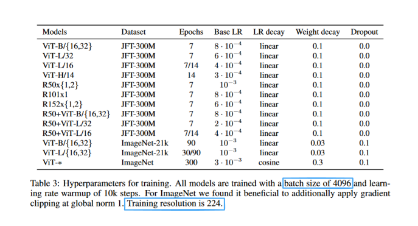
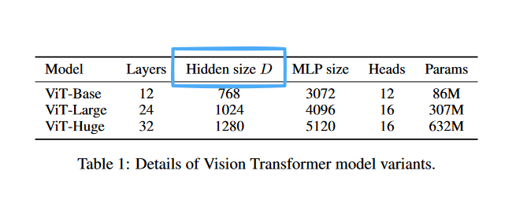
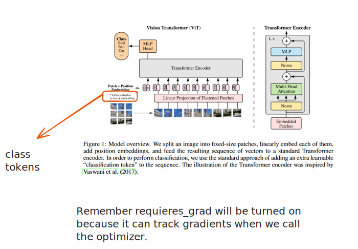
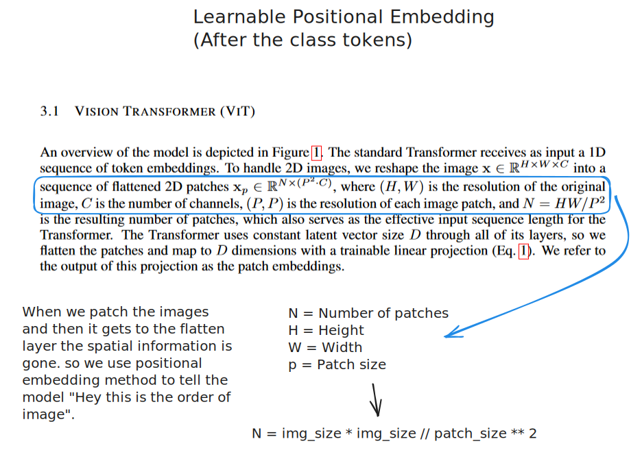

## Implemention of  Vision Transformer (ViT) from Scratch

### Overview

This project implements a Vision Transformer (ViT) model from scratch for image classification tasks. The model architecture is based on the Vision Transformer paper and is designed to handle various image classification tasks using PyTorch.

Inspired by the Transformer scaling successes in NLP, we experiment with applying a standard
Transformer directly to images, with the fewest possible modifications. To do so, we split an image
into patches and provide the sequence of linear embeddings of these patches as an input to a Trans-
former. Image patches are treated the same way as tokens (words) in an NLP application. We train
the model on image classification in supervised fashion

### Files

`src/utils.py`: Provides functionality for saving models.

`vit.py`: Contains the Vision Transformer model definition.

`src/data_setup.py`: Handles data loading and preprocessing.

`src/engine.py`: Contains functions for training and evaluating the model.

`src/helper_function.py`: Includes utility functions such as plotting loss curves.

### Visualizations

Refer to the following images for model architecture and embeddings:

### Citations 

### Citations

This project attempts to replicate the official Vision Transformer model (ViT) as described in the paper:
**[An Image is Worth 16x16 Words: Transformers for Image Recognition at Scale](https://arxiv.org/pdf/2010.11929)**

by Alexey Dosovitskiy, et al. (2020). The Vision Transformer (ViT) paper introduces a novel approach to image classification using transformers, which this project aims to replicate.

